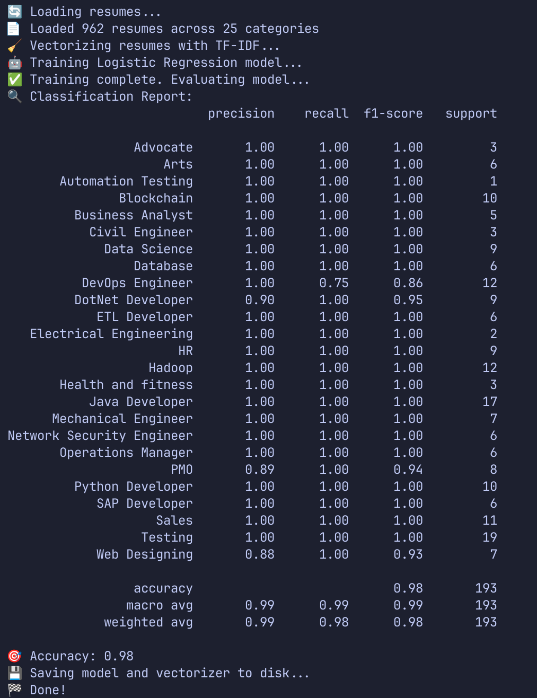

<div align="center">

# 🤖 ML-Powered Resume Analyzer

### Intelligent Resume Classification & Analysis using Machine Learning and NLP

Automatically classify resumes into job categories, extract meaningful insights, and provide actionable improvement suggestions using Natural Language Processing (NLP), TF-IDF, Sentence Transformers, and Machine Learning.


</div>

---

# 📖 Table of Contents

- Overview
- Features
- Demo Workflow
- Project Architecture
- Machine Learning Pipeline
- Tech Stack
- Folder Structure
- Installation
- Dataset
- Usage
- Configuration
- Model Details
- Resume Advice Engine
- Future Improvements
- Contributing
- License
- Author

---

# 📌 Overview

Recruiters receive hundreds of resumes every day.

Manually sorting them into suitable job categories is time-consuming and inconsistent.

This project automates that process using Natural Language Processing (NLP) and Machine Learning.

The system:

- Converts resumes into readable text
- Cleans and preprocesses the content
- Extracts textual features
- Classifies resumes into job domains
- Generates personalized improvement suggestions

Everything runs locally, making the project privacy-friendly since resumes never leave your machine.

---

# ✨ Features

✅ Resume PDF to Text Conversion

✅ CSV Resume Dataset Processing

✅ Text Cleaning & NLP Preprocessing

✅ TF-IDF Feature Extraction

✅ Logistic Regression Classifier

✅ Sentence Transformer Embeddings

✅ Resume Category Prediction

✅ Resume Quality Analysis

✅ Keyword Suggestions

✅ Missing Section Detection

✅ CLI-Based Workflow

✅ YAML Configuration Support

---

# 🎯 Demo Workflow

```
                Resume
                   │
                   ▼
          PDF / CSV Conversion
                   │
                   ▼
          Text Preprocessing
                   │
                   ▼
          Feature Extraction
         (TF-IDF / Embeddings)
                   │
                   ▼
      Machine Learning Classifier
                   │
                   ▼
     Resume Category Prediction
                   │
                   ▼
        Resume Advice Generator
```

---

# 🏗 Project Architecture

```
                 +-------------------+
                 |   Resume Dataset  |
                 +---------+---------+
                           |
                           ▼
                  Resume Converter
                           |
                           ▼
                 Text Preprocessing
                           |
                           ▼
               Feature Engineering
          +-----------------------------+
          | TF-IDF | SentenceTransformer |
          +-----------------------------+
                           |
                           ▼
              Logistic Regression Model
                           |
                           ▼
                  Resume Prediction
                           |
                           ▼
                 Resume Advice Engine
```

---

# 🧠 Machine Learning Pipeline

## 1. Data Collection

Training Dataset:

- Updated Resume Dataset (CSV)

Testing Dataset:

- Resume PDFs

---

## 2. Data Cleaning

The preprocessing stage performs:

- Lowercase conversion
- URL removal
- HTML tag removal
- Special character removal
- Stopword removal
- Whitespace normalization

---

## 3. Feature Engineering

### TF-IDF

Converts textual information into numerical vectors while preserving important word frequencies.

### Sentence Transformers

Uses pre-trained embeddings for richer semantic understanding of resume content.

Current embedding model:

```
all-MiniLM-L6-v2
```

---

## 4. Classification

Current baseline model:

- Logistic Regression

Future planned models:

- SVM
- Random Forest
- XGBoost
- LightGBM
- Neural Networks

---

# 💻 Tech Stack

## Programming

- Python

## Machine Learning

- Scikit-learn
- Sentence Transformers

## NLP

- NLTK
- Regular Expressions

## Data Processing

- Pandas
- NumPy

## File Handling

- PyPDF2
- PDFPlumber

## Configuration

- YAML

---
Example output plot:


---

# 📂 Folder Structure

```
ML-powered_resume_analyser/

│
├── data/
│   ├── raw/
│   ├── processed/
│   ├── test/
│
├── models/
│
├── src/
│   ├── convert_dataset.py
│   ├── convert_test_data.py
│   ├── train_classifier.py
│   ├── predict.py
│   ├── advice.py
│
├── assets/
│
├── config.yaml
├── requirements.txt
└── README.md
```

---

# ⚙ Installation

## Clone Repository

```bash
git clone https://github.com/yourusername/ML-powered_resume_analyser.git

cd ML-powered_resume_analyser
```

---

## Create Virtual Environment

Windows

```bash
python -m venv .venv

.venv\Scripts\activate
```

macOS/Linux

```bash
python3 -m venv .venv

source .venv/bin/activate
```

---

## Install Dependencies

```bash
pip install -r requirements.txt
```

Compatibility Fix

```bash
pip install numpy==1.26.0 --force-reinstall
```

---

# 📊 Dataset

Training Dataset

```
UpdatedResumeDataSet.csv
```

Testing

```
Resume PDFs
```

Recommended structure

```
data/

raw/
processed/
test/
```

---

# 🚀 Usage

## Convert CSV Dataset

```bash
python src/convert_dataset.py \
--csv data/raw/UpdatedResumeDataSet.csv \
--outdir data/processed/converted
```

---

## Convert Resume PDFs

```bash
python src/convert_test_data.py \
--pdfdir data/test \
--outdir data/processed/converted_test
```

---

## Train Model

```bash
python src/train_classifier.py
```

---

## Predict Resume Category

```bash
python src/predict.py --input resume.txt
```

---

## Generate Resume Advice

```bash
python src/advice.py --input resume.txt
```

---

# ⚙ Configuration

```yaml
model:

  embedding: all-MiniLM-L6-v2

  tfidf_max_features: 1000

  advice_threshold: 0.5
```

---

# 📈 Model Details

| Component | Algorithm |
|-----------|-----------|
| Feature Extraction | TF-IDF |
| Embeddings | Sentence Transformers |
| Classifier | Logistic Regression |
| Language | English |
| Prediction | Resume Category |

---

# 💡 Resume Advice Engine

The advice module currently evaluates:

- Resume Length
- Missing Keywords
- Missing Sections
- Soft Skills
- Resume Structure
- Role Match
- Improvement Suggestions

Example Output

```
Predicted Category

→ Data Scientist

Suggestions

✔ Add Projects section

✔ Include SQL keyword

✔ Mention TensorFlow experience

✔ Improve resume summary

✔ Add measurable achievements
```

---

# 📸 Screenshots

Add screenshots here after running the project.

Example:

```
assets/

home.png

prediction.png

advice.png

training.png
```

Then include

```markdown


```

---

# 📊 Future Improvements

- Web Interface using Flask
- Streamlit Dashboard
- Deep Learning Classifier
- Resume Ranking
- Skill Extraction
- ATS Score Prediction
- GPT-powered Resume Feedback
- Docker Support
- REST API
- Multi-language Resume Support

---

# 🤝 Contributing

Contributions are welcome.

To contribute:

1. Fork the repository

2. Create a new branch

```bash
git checkout -b feature-name
```

3. Commit changes

```bash
git commit -m "Added feature"
```

4. Push

```bash
git push origin feature-name
```

5. Open a Pull Request

---

# 📄 License

This project is licensed under the MIT License.

---

# 👨‍💻 Author

**Ruthvik Sharma**

AI & Machine Learning Engineer

GitHub:
https://github.com/ruthviksharma-d

LinkedIn:
https://linkedin.com/in/ruthvik-sharma

---

<div align="center">

⭐ If you found this project useful, consider giving it a star!

</div>
